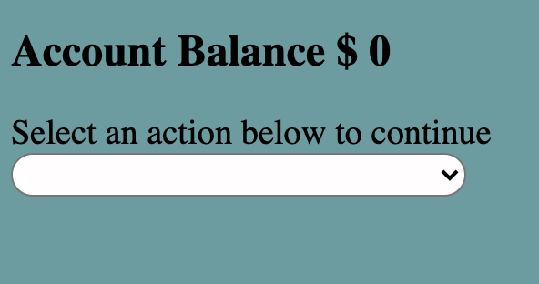

# React ATM App

## Description
This project is the start of an ATM app using react. In it's current state, it can only do two functions which are withdraw and deposit. This ATM app has the ability to alert the user if they are attempting to withdraw more than what they currently have in the bank. 

## Installation 
Download a copy of this repo. Open the repo in your favorite code editor and terminal to the project's directory. Now you are ready to run the app in the delvopment mode by using 'npm start.

### `npm start`

Npm start runs the app in the development mode.\
Open [http://localhost:3000](http://localhost:3000) to view it in the browser.

The page will reload if you make edits.\
You will also see any line errors in the console.

## Usage
This project is an example of a form that is universal across many platforms. 

## Support
This project was bootstrapped with [Create React App](https://github.com/facebook/create-react-app).
You can learn more in the [Create React App documentation](https://facebook.github.io/create-react-app/docs/getting-started). To learn React, check out the [React documentation](https://reactjs.org/).\
[MDN Web Docs](https://developer.mozilla.org/en-US/docs/Web/JavaScript)

## Roadmap
My goal for this project is to continue to add more banking features while growning in it's design to make the application intuitive.

## License Information
MIT